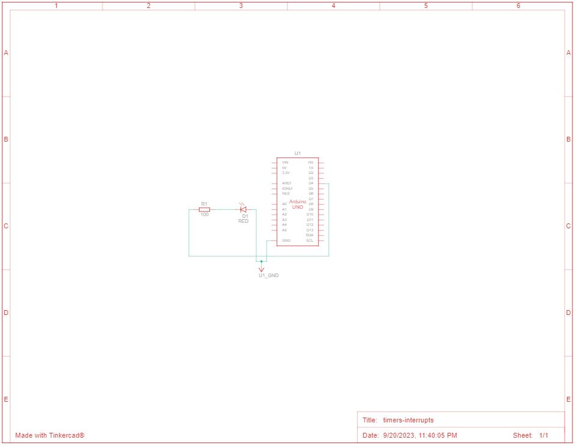
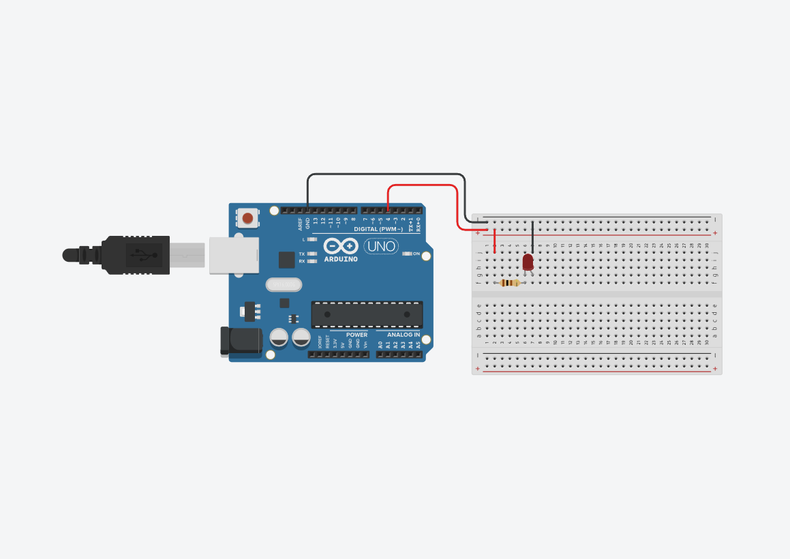

# Temporizadores e Contadores no ATmega2560 ⌛

The objective of this project is to understand the concept of timers/counters in microcontrollers. To do this, we use the practical example of connecting an LED to explore and learn how to use them on the ATmega2560.

> Definition: A timer is an electronic component that generates time delays or counts events at regular intervals.

As a direct consequence of the definition, they are used to generate periodic signals and events, as well as internal or external clock pulses.

<small>*Timers/Counters are important in embedded systems because they are associated with time precision, sequence control, temporal measurements and PWM (Pulse Width Modulation).*</small>

## 📦 Components

|Name  |Quantity|Component                  |
|------|--------|---------------------------|
|U1    |1       | Arduino Mega ATMega2560¹   |
|D1    |1       | RED LED                   |
|R1    |1       | 100 Ω Resistor            |

## Circuit used ⚡

|Schematic¹  | Preview¹ |
|------|--------|
|||

> 1. *In the preview and schematic built in tinkercad and shown above, it is necessary to note that the Arduino Uno was used with the ATMega328p microcontroller. However, this assembly was only used for simulation. The circuit structure followed the same for the laboratory with the difference that the Arduino used in practice for the experiment was the Arduino Mega with ATMega2560 microcontroller.*

## 🤖 Settings
- Timers in Normal mode of operation (table 16-8 of [DataSheet](./assets/docs/Atmega2560-Datasheet.pdf)), which is the simplest mode of operation ***TC0 Normal Mode***.
- Interrupt enablement is generated upon overflow. Overflow occurs when it returns to `0` and the `TOV0` overflow flag bit is set to `1`.

    To use `TC0`, it is necessary to configure three registers:
    
    - `TCCR0A` (Configuration mode);
    - `TCCR0B` (Prescaler configuration);
    - `TIMSK0` (Interrupt enablement).

## Implementation in C

```c
#include <avr/io.h>
#include <avr/interrupt.h>
#include <util/delay.h>

int main(void){              
    DDRG = 0b00100000;
    TCCR0A = 0b00000000;
    TCCR0B = 0b00000001;
    TIMSK0 = 0b00000001;
    sei(); 
    
    while(1){ }
    
    return 0;
}

ISR(TIMER0_OVF_vect){
    if(PING & 0b00100000){
        PORTG = 0b00000000;
    }else{
        PORTG = 0b00100000;
    }
}
```

* Code steps:
    1. Include the libraries
    2. Configure the loggers
    3. Enable global outages
    4. Apply the main program to the loop
    5. Apply the interrupt routine

## 🔬 Prática Laboratorial

In laboratory practice we work on analyzing the generation of signals using the timer, in the practical and basic example of turning on an LED. See our results by accessing [link](https://youtu.be/ZxBM4SYjZ8c).

## ✍️ Authors
- [Ernane Ferreira](https://github.com/ernanej) 🧑🏼‍💻
- [Quelita Míriam](https://github.com/quelita2) 👩🏼‍💻
- [Thiago Lopes](https://github.com/thiagonasmto) 🧑🏼‍💻

---

<div align="center">
  DCA0119 - Digital Systems (2023.1) <br/>
  Federal University of Rio Grande do Norte - Department of Computer and Automation Engineering (DCA).
</div>